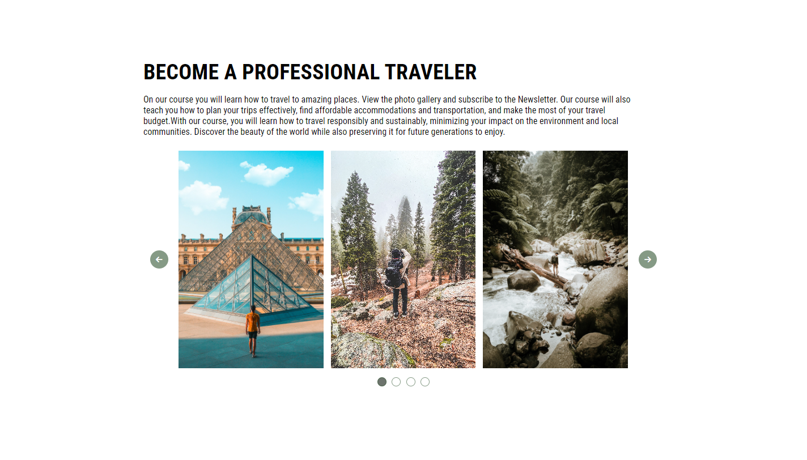

# TL - Slider Challange

My task was to create a simple slider in Vanilla JavaScript. This project is an attempt to create something from scratch, learn to debug, and above all, have fun with code.

## Table of contents

- [Overview](#overview)
  - [The challenge](#the-challenge)
  - [Screenshot](#screenshot)
- [My process](#my-process)
  - [Built with](#built-with)
  - [Continued development](#continued-development)

## Overview

Visit: https://asd-slider.netlify.app/

### The challenge

Things to do:
- responsive web design
- use of BEM methodology

### Screenshot

Desktop:  

Mobile:  

## My process

### Built with

- Semantic HTML5 markup
- CSS3
- BEM
- Vanilla JavaScript

### Continued development

- I would like to add some CSS animations.
